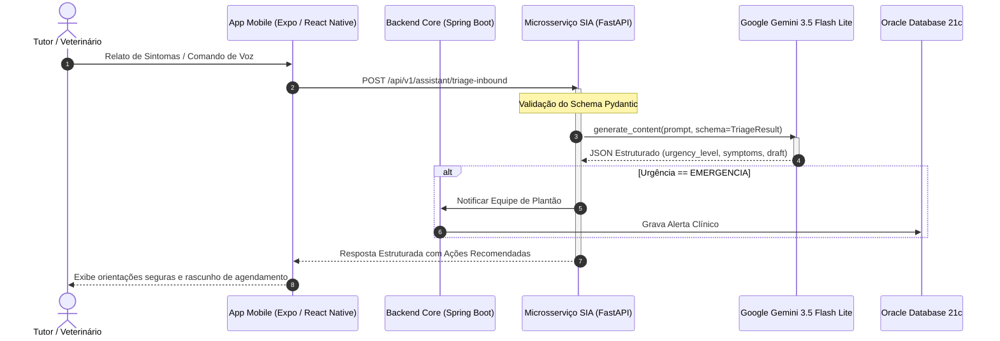

# Arquitetura e Conceitos de Inteligência Artificial — SIA (Sync Inteligência Artificial)
**Disciplina:** Disruptive Architectures: IoT, IoB & Generative IA  
**Projeto:** ClyvoVet (Mobile) / VetSync (Backend) / SIA (Microsserviço de IA)  
**Parceira Corporativa:** Clyvo Vet  
**Semestre:** 2º Semestre — Sprint 3  

---

## 1. Definição do Problema de Negócio na Jornada Contínua do Pet

### 1.1 O Cenário da "Cultura da Emergência"
No mercado veterinário brasileiro, mais de **60% dos atendimentos em planos de saúde pet ocorrem em pronto-socorro/emergência**, onde o custo médio por evento clínico ultrapassa R$ 800,00. Esse padrão gera:
* **Relação transacional e reativa:** O tutor só procura assistência quando o animal já apresenta quadro crítico de dor ou risco de morte;
* **Falta de prevenção periódica:** Longos períodos de inatividade sem revacinações, vermifugações, check-ups odontológicos ou profilaxias;
* **Custo elevado para clínicas e operadoras:** Aumento severo da sinistralidade médica e evasão do tutor após episódios pontuais.

### 1.2 A Solução da SIA (Sync Inteligência Artificial)
A SIA transforma essa relação reativa em um **Ciclo Contínuo de Cuidado (*Health Loop*)**:
1. **Triagem Ativa e Não Prescritiva:** Atua como canal de primeiro contato para interpretar relatos de tutores, classificando o nível de urgência com abordagem clínica conservadora e acionando o pronto-atendimento quando necessário.
2. **Acompanhamento Pós-Atendimento e Pós-Cirúrgico (*Check-in*):** Monitora a recuperação do pet após intervenções cirúrgicas ou consultas, identificando sinais de complicação precocemente (*red flags*).
3. **Agendamento Inteligente com Redução de Atrito:** Facilita a marcação de consultas preventivas e retornos através de linguagem natural (voz ou texto), conectando-se diretamente à disponibilidade médica da clínica.
4. **Produtividade do Médico Veterinário:** Converte comandos falados ou digitados em planos estruturados de alta hospitalar e pós-atendimento sem a necessidade de preenchimento manual burocrático de formulários.

---

## 2. Personalização, Priorização e Apoio à Tomada de Decisão

A IA atua em quatro frentes especializadas de apoio à decisão:

```
                                  ┌────────────────────────────────┐
                                  │   Mensagem / Comando Natural   │
                                  └───────────────┬────────────────┘
                                                  │
                                                  ▼
                                  ┌────────────────────────────────┐
                                  │    SIA Orquestrador (FastAPI)   │
                                  └───────┬───────────────┬────────┘
                                          │               │
                 ┌────────────────────────┼───────────────┼────────────────────────┐
                 ▼                        ▼               ▼                        ▼
        ┌─────────────────┐     ┌─────────────────┐ ┌───────────────┐     ┌─────────────────┐
        │ 1. Triagem de   │     │ 2. Check-in Pós │ │ 3. Agendamento│     │ 4. Pós-Atend.   │
        │    Urgência     │     │    Cirúrgico    │ │    Inteligente│     │    Clínico      │
        └────────┬────────┘     └────────┬────────┘ └───────┬───────┘     └────────┬────────┘
                 │                       │                  │                      │
                 ▼                       ▼                  ▼                      ▼
        [Classificação Risco:   [Classificação:     [Ação / Data / Horário [Plano Estruturado:
         EMERGÊNCIA/URGÊNCIA/   NORMAL/ALERTA/       sem conflitos médicos  retorno, receitas,
         ROTINA/ADMIN]          COMPLICAÇÃO]         via Function Calling]   prontuário, texto]
```

### 2.1 Triagem de Risco (`/api/v1/assistant/triage-inbound`)
* **Critério Conservador:** Em caso de dúvida ou sintomas mistos, a IA sempre opta pela classificação mais grave (`EMERGENCIA`), notificando a equipe da clínica (`notify_team: true`).
* **Sintomas Extraídos:** Isola termos clínicos relevantes a partir do relato leigo do tutor (ex: de *"meu cachorro tá mole e com a gengiva branca"* para `["prostração", "mucosa pálida"]`).

### 2.2 Monitoramento Pós-Cirúrgico (`/api/v1/assistant/parse-checkin-response`)
* **Detecção de *Red Flags*:** Avalia o tempo decorrido da cirurgia (`days_post_surgery`) contra sintomas normais vs sinais de alarme (deiscência de pontos, secreção purulenta, hipotermia, anorexia prolongada).
* **Alerta ao Especialista:** Se `recovery_status == 'COMPLICACAO_CRITICA'`, dispara alerta imediato para o médico responsável.

### 2.3 Agendamento Conversacional com *Function Calling* (`/api/v1/assistant/parse-scheduling`)
* Através de chamadas automáticas de função (`consultar_disponibilidade`), a IA consulta agendas reais e responde propondo horários viáveis sem alucinação.

### 2.4 Pós-Atendimento e Alta (`/api/v1/assistant/parse-intent`)
* Estrutura data de retorno, necessidade de anexos de receitas e prontuários, e produz uma minuta de mensagem personalizada para envio via WhatsApp ou E-mail.

---

## 3. Catálogo e Dicionário de Dados da IA

A tabela abaixo descreve os dados consumidos, transformados e gerados pelo microsserviço de IA:

| Entidade / Campo | Tipo | Origem | Destino | Finalidade na IA |
| :--- | :---: | :---: | :---: | :--- |
| `prompt` / `message` | `str` | Tutor ou Veterinário | SIA / Gemini | Entrada em linguagem natural livre. |
| `history` | `list[dict]` | Mobile / Sessão | Gemini Context | Histórico de mensagens anteriores para manter coerência multi-turn. |
| `patient_species` | `str` | App / Banco de Dados | Gemini System Prompt | Adaptação do contexto fisiológico (cão, gato, ave, etc.). |
| `days_post_surgery` | `int` | Prontuário / Agenda | Gemini Context | Avaliação da linha temporal esperada de cicatrização pós-operatória. |
| `urgency_level` | `str` | Gemini (`TriageResult`) | App / Equipe Médica | Categorização estrita: `EMERGENCIA`, `URGENCIA`, `ROTINA`, `ADMINISTRATIVO`. |
| `red_flags` | `list[str]` | Gemini (`CheckinResult`) | Dashboard Vet | Lista de sinais de complicação identificados no relato. |
| `action` | `str` | Gemini (`SchedulingIntent`)| Backend Java / Motor de Agenda | Ação detectada: `CONSULTAR`, `RESERVAR`, `CANCELAR`, `REAGENDAR`. |
| `days_until_follow_up`| `int` | Gemini (`ClinicalPostCarePlan`)| Agenda / Notificações | Cálculo automático do dia exato para o retorno do paciente. |
| `message_draft` | `str` | Gemini | Notificação / Tutor | Rascunho empático pronto para envio ao tutor. |

---

## 4. Justificativa Técnica da Abordagem Adotada

A solução adotou **Modelos de Linguagem de Grande Escala (LLM - Google Gemini)** com **Saídas Estruturadas (Pydantic v2)** e **Chamada de Ferramentas (*Function Calling*)**, refutando abordagens tradicionais de NLP baseadas em regras determinísticas ou regex:

1. **Variabilidade Linguística no Meio Veterinário:**
   * Tutores usam linguagem informal, coloquial ou em estado de estresse (*"ele tá vomitando gosma amarela desde ontem"*). Modelos de regras falham miseravelmente ao capturar sinonímias e nuances clínicas.
2. **Eliminação de Alucinações com *Structured Outputs*:**
   * A integração utiliza o recurso nativo `response_schema` com Pydantic v2 do SDK `google-genai`. A LLM é forçada a retornar um JSON estritamente compatível com o modelo de dados, evitando respostas quebradas ou com chaves inexistentes.
3. **Guardrails Rígidos de Segurança Clínica:**
   * As *System Instructions* proíbem expressamente a prescrição de medicamentos, diagnósticos fechados e desvios de assunto (fora do contexto veterinário), garantindo a conformidade ética e jurídica da clínica.
4. **Clean Architecture (*Ports & Adapters*):**
   * O microsserviço isola as regras em UseCases puros (`application/use_cases.py`), desacoplando a camada de transporte (FastAPI) da implementação concreta de IA (`infrastructure/gemini_gateway.py`), facilitando testes com mocks e evolução de modelos.

---

## 5. Diagrama Arquitetural Completo de Integração


