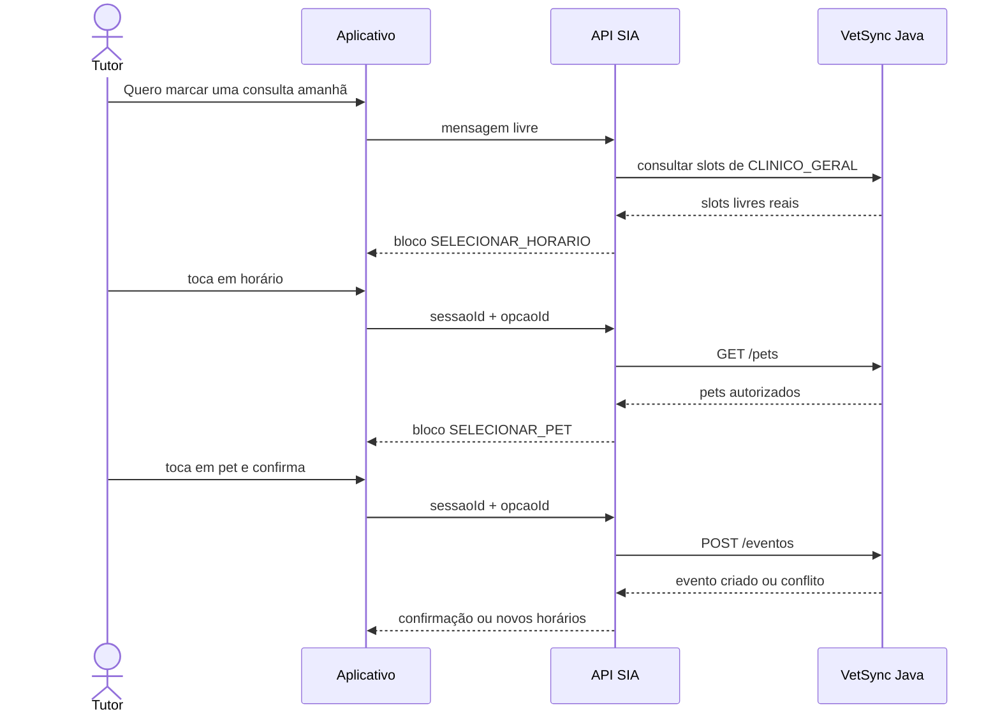

# Especificação — agendamento por blocos no chat SIA

**Status:** implementado nos repositórios SIA, Java e Mobile. A disponibilidade
em ambiente publicado depende da migração `V21` no Java e da publicação dos
três serviços; este documento não confirma essa publicação.

## Objetivo

Uma mensagem livre inicia o agendamento. As escolhas previsíveis são feitas por
blocos selecionáveis no aplicativo, para que o modelo não interprete nomes,
horários ou identificadores que já existem nos cadastros da VetSync.

O primeiro recorte atende **consulta de clínico geral**. O fluxo não confirma
diagnóstico, não prescreve e não substitui a avaliação presencial.

## Decisões do fluxo

1. O tutor escreve: `Quero marcar uma consulta amanhã`.
2. A SIA identifica a intenção de agendar e resolve a data para uma data
   absoluta no fuso `America/Sao_Paulo`.
3. A API consulta no Java os slots livres de `CLINICO_GERAL` para a data e
   responde com um bloco `SELECIONAR_HORARIO`.
4. O tutor toca em um horário. Cada opção já aponta para o veterinário e o tipo
   de evento válidos; o aplicativo não mostra nem envia esses IDs como texto.
5. A API responde com `SELECIONAR_PET`, usando somente os pets do tutor
   autenticado.
6. Após a escolha do pet, a API mostra um resumo e o bloco `CONFIRMAR_RESERVA`.
7. Somente o toque em `Confirmar reserva` chama `POST /eventos` no Java.
8. A SIA confirma a consulta somente se o Java devolver sucesso. Um conflito
   devolve novos horários; nenhuma reserva é criada antes disso.

Este primeiro recorte opera somente com `CLINICO_GERAL`. A escolha de outros
tipos de atendimento ainda precisa ser implementada com um catálogo real do
Java e um bloco próprio; ela não faz parte do fluxo atual.



## Blocos devolvidos ao aplicativo

O endpoint de chat deixará de retornar apenas `mensagem`. A resposta futura
terá texto humano e, quando aplicável, uma ação estruturada:

```json
{
  "mensagem": "Encontrei estes horários para consulta de clínico geral em 30/09.",
  "bloco": {
    "tipo": "SELECIONAR_HORARIO",
    "sessaoId": "uuid",
    "titulo": "Escolha um horário",
    "opcoes": [
      {
        "id": "slot-assinado",
        "rotulo": "09:00",
        "descricao": "Dra. Ana",
        "habilitado": true
      }
    ]
  }
}
```

Tipos de bloco da primeira versão:

| Tipo | Quando aparece | Dados exibidos |
| --- | --- | --- |
| `SELECIONAR_DATA` | A mensagem não contém data compreensível | três datas sugeridas |
| `SELECIONAR_HORARIO` | Há data e tipo definidos | horário e veterinário responsável |
| `SELECIONAR_PET` | Há slot escolhido | nome e espécie dos pets autorizados |
| `CONFIRMAR_RESERVA` | Há slot e pet escolhidos | pet, tipo, data, horário e veterinário |

O valor técnico de uma opção fica no servidor. O aplicativo envia somente
`sessaoId` e `opcaoId` à rota de seleção. Essa rota valida que a opção pertence
à sessão e ao tutor autenticado antes de avançar.

## Estado da sessão de agendamento

A SIA deverá manter uma sessão curta, expirada e vinculada ao tutor autenticado.
Ela contém os campos que serão usados no Java:

```text
estado: AGUARDANDO_DATA | AGUARDANDO_HORARIO |
        AGUARDANDO_PET | AGUARDANDO_CONFIRMACAO | CONCLUIDA | EXPIRADA
idTipoEvento: obrigatório antes de consultar slots
idVeterinario: definido pela escolha do slot
dtEvento e hrEvento: definidos pela escolha do slot
idPet: definido pelo bloco de pets
dsObservacao: opcional, informada em texto livre
```

Nesta primeira implementação, a sessão fica em memória por 15 minutos e é
perdida se a instância da SIA reiniciar. A persistência compartilhada deverá
ser adicionada antes de executar mais de uma instância da API.

Uma seleção direta não chama o modelo. A rota de conversa reconhece palavras
de agendamento e resolve as datas suportadas de forma determinística; as
opções seguintes avançam somente pela sessão.

## Contratos necessários

### Java — disponibilidade real

Consulta autenticada de slots implementada:

```text
GET /agenda/slots?data=YYYY-MM-DD&modalidade=CLINICO_GERAL
```

Resposta proposta:

```json
{
  "data": "2026-09-30",
  "slots": [
    {
      "idTipoEvento": 8,
      "nmTipoEvento": "Consulta de rotina",
      "idVeterinario": 4,
      "nmVeterinario": "Dra. Ana",
      "hrEvento": "09:00"
    }
  ]
}
```

O Java deve calcular esses slots com a disponibilidade semanal do veterinário,
bloqueios e eventos `AGENDADO`. O tamanho de cada atendimento é uma
configuração real do tipo de evento; não será assumido pela SIA. A modalidade
`CLINICO_GERAL` fica em `dsModalidadeAgendamento`, separada de `dsCategoria`,
que já representa categorias clínicas amplas.

`POST /eventos` permanece a única operação que cria a consulta. Ele precisa
revalidar bloqueio e conflito no momento da criação e devolver `409` quando o
slot tiver sido ocupado.

### SIA — início e seleções

O endpoint de conversa é a entrada de texto livre:
`POST /api/v1/ia/orquestrador/processar`. A resposta inclui o campo opcional
`bloco` quando há uma escolha estruturada.

As escolhas dos blocos usam uma rota sem modelo:

```text
POST /api/v1/ia/orquestrador/agendamentos/sessoes/{sessaoId}/selecoes
{
  "opcaoId": "slot-assinado"
}
```

Cada resposta dessa rota tem o mesmo formato de `mensagem` e `bloco`. A última
confirmação realiza o `POST /eventos` com o Bearer original do tutor.

## Regras de segurança e falha

- O Java continua validando a posse do pet pelo JWT; a SIA não é autoridade de
  autorização.
- IDs de pet, tipo e veterinário recebidos pelo aplicativo nunca são aceitos
  sem validação contra a sessão e os dados atuais do Java.
- Uma sessão expirada ou uma opção inválida devolve uma mensagem para o tutor
  reiniciar o agendamento e consultar os dados atuais.
- Se não houver slots, o bloco oferece três datas locais para nova consulta e
  informa claramente a ausência de disponibilidade.
- Se uma mensagem trouxer sintomas e pedido de consulta, a SIA envia uma
  orientação curta para avaliação presencial e mantém o fluxo de agendamento.
  Ela não classifica urgência, diagnostica nem recomenda medicamento.

## Limites atuais confirmados

- As sessões ficam em memória no processo da SIA. Uma reinicialização as perde
  e múltiplas instâncias exigem armazenamento compartilhado.
- O fluxo implementado cobre somente `CLINICO_GERAL`. A seleção de outros
  serviços por bloco ainda não existe.
- A consulta de slots usa disponibilidade semanal, bloqueios e eventos
  `AGENDADO`. O endpoint de criação deve validar também a disponibilidade
  semanal quando receber chamadas diretas, para manter a mesma regra fora do
  fluxo de blocos.
- A data reconhecida no texto livre cobre hoje, amanhã, ISO e `dia N`; outras
  formas de linguagem natural ainda precisam de uma resolução determinística
  ou de uma interface de calendário.
